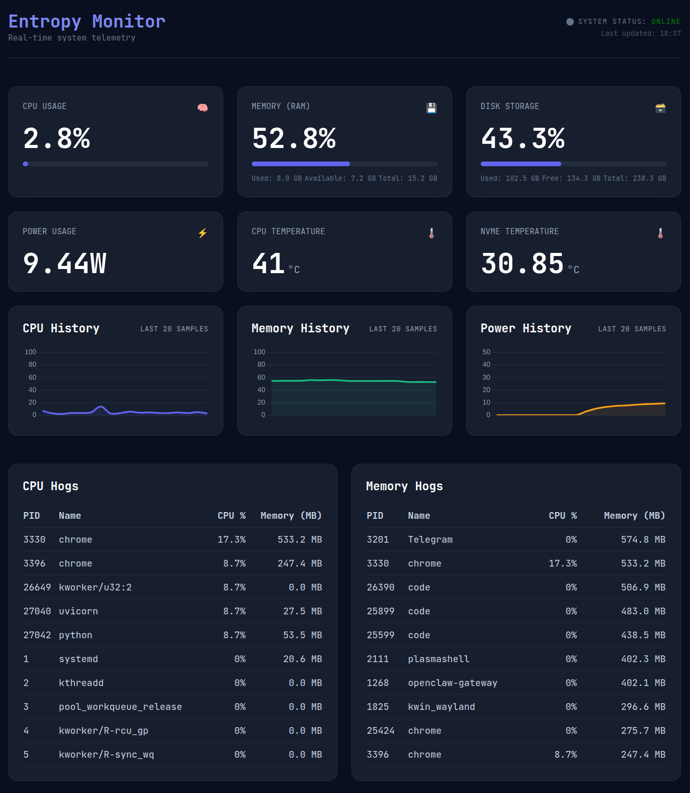

# Entropy Monitor

A lightweight, real-time system monitoring dashboard built with **FastAPI** and **vanilla JavaScript**.

Tracks CPU usage, RAM, disk space, battery power draw, and the top 10 most resource-hungry processes — all displayed in a clean, dark-themed single-page UI.


> [!NOTE]
> This project currently only supports **Linux** systems.
> It relies on Linux-specific paths like `/sys/class/thermal/` for temperature
> sensors and `psutil.sensors_temperatures()` which may not work on Windows or macOS.

## Features

- **CPU** — system-wide utilisation percentage with colour-coded progress bar
- **Memory** — used, available, and total RAM in GiB
- **Disk** — root partition usage with used/free/total breakdown
- **Power** — instantaneous battery draw in watts (Linux laptops)
- **Top Processes** — 10 most CPU-intensive and 10 most Memory-intesive processes with PID, name, CPU %, and RSS memory
- **Auto-refresh** — frontend polls the backend at a configurable interval (default 6 s)
- **Self-configuring frontend** — the JS client fetches its API URL and poll interval from a `/config` endpoint, keeping hard-coded values to a minimum



## Tech Stack

| Layer     | Technology                        |
|-----------|-----------------------------------|
| Backend   | Python, FastAPI, Pydantic, psutil |
| Server    | Uvicorn                           |
| Frontend  | HTML, vanilla JavaScript          |
| Styling   | Tailwind CSS (CDN), JetBrains Mono |
| Config    | pydantic-settings + `.env` file   |

## Getting Started

### Prerequisites

- Python 3.12 or newer

### Setup

```bash
# Clone the repo
git clone https://github.com/MichalPolach/Entropy-Monitor
cd Entropy-Monitor

# Create and activate a virtual environment
python -m venv venv
source venv/bin/activate   # Linux / macOS

# Install dependencies
pip install -r requirements.txt
```

### Run

```bash
# Start the API server
uvicorn main:app --port 8000 --reload
```

Then open `index.html` in your browser (or serve it with any static file server on the port matching your CORS config).

The interactive API docs are available at [http://localhost:8000/docs](http://localhost:8000/docs).

## Configuration

All settings can be overridden with environment variables or a `.env` file in the project root:

| Variable           | Default                  | Description                              |
|--------------------|--------------------------|------------------------------------------|
| `BACKEND_PORT`     | `8000`                   | Port the backend runs on                 |
| `BACKEND_ADDRESS`  | `http://localhost`       | Scheme + host for the API URL            |
| `CORS_ORIGINS`     | `http://localhost:8080`  | Comma-separated allowed origins          |
| `POLL_INTERVAL_MS` | `6000`                   | Frontend polling interval in ms          |
| `APP_TITLE`        | `System Monitor`         | Title shown in the API docs              |
| `APP_DESCRIPTION`  | `System Monitor API`     | Description shown in the API docs        |

Example `.env`:

```env
BACKEND_PORT=8003
CORS_ORIGINS=http://localhost:5500,http://127.0.0.1:5500
POLL_INTERVAL_MS=3000
```

## Project Structure

```
sysmon/
├── main.py            # FastAPI app — defines /config and /stats endpoints
├── monitor.py         # System metric collector (psutil wrapper)
├── schemas.py         # Pydantic response models
├── config.py          # Centralised settings via pydantic-settings
├── index.html         # Single-page dashboard layout
├── app.js             # Frontend polling logic and DOM updates
├── requirements.txt   # Pinned Python dependencies
└── .gitignore
```

## API Endpoints

### `GET /config`

Returns the backend URL and poll interval for the frontend to self-configure.

```json
{
  "url": "http://localhost:8000",
  "poll_interval": 6000
}
```

### `GET /stats`

Returns a full system telemetry snapshot.

```json
{
  "cpu": 12.3,
  "memory_total": 15.4,
  "memory_used": 8.2,
  "memory_available": 7.2,
  "memory_percent": 53.1,
  "disk_percent": 42.0,
  "disk_used": 98.7,
  "disk_free": 136.5,
  "disk_total": 235.2,
  "power_watts": 14.52,
  "top_processes_cpu": [
    {
      "pid": 1234,
      "name": "firefox",
      "cpu_percent": 8.5,
      "memory_mb": 512.3
    }
  ],
    "top_processes_mem": [
    {
      "pid": 1234,
      "name": "firefox",
      "cpu_percent": 8.5,
      "memory_mb": 512.3
    }
  ]
}
```

## Notes

- **Power draw** reads from `/sys/class/power_supply/BAT0/power_now` and returns `0.0` on desktops or systems without that sensor.
- The CPU metric uses a 1-second blocking interval for an accurate reading, so each `/stats` call takes ~1.1 s.
- This is a personal portfolio project — not designed for production use.

## License

MIT
